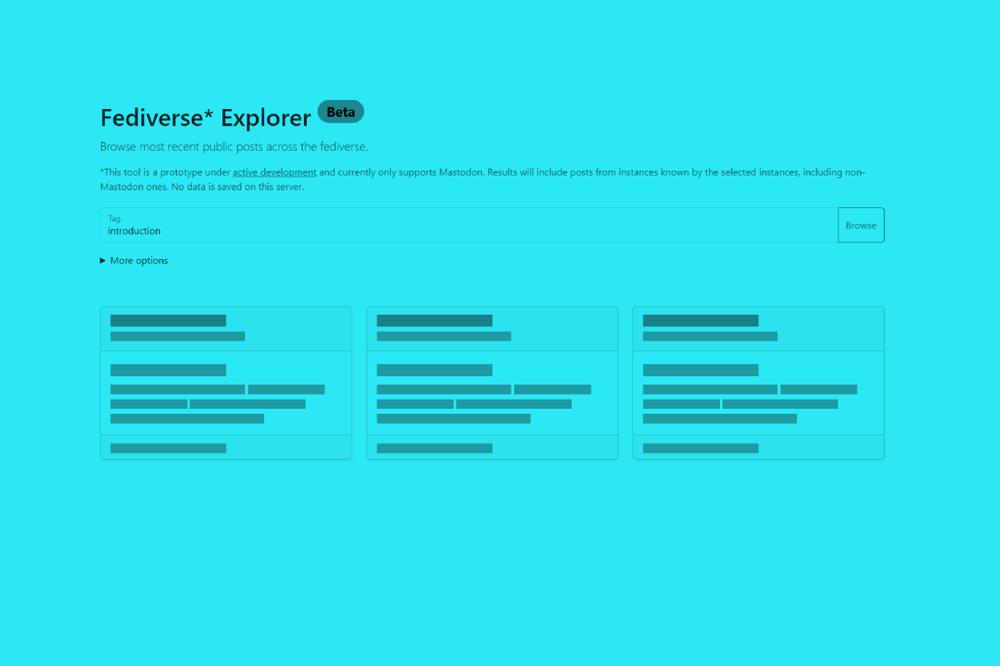

# Fediverse Explorer

Browse most recent public posts across the fediverse.

This tool is a prototype and under active development. Currently only supports Mastodon instances, but the results will include posts from instances known by the selected instances, including non-Mastodon ones. No data is saved on the server outside of the currently viewed results being briefly cached for performance reasons.

[More about the project on my blog](https://stefanbohacek.com/project/fediverse-explorer/)

## Features

- browse hashtags across multiple Mastodon instances
- open posts from your own instance
- automatic dark mode

## How it works

This tool parses the built-in public RSS feed for each searched tag and selected instances. 

```
https://mastodon.social/tags/introduction.rss
```

## Todo

- option to log in and import lists of blocked and muted accounts and instances

## Development

```sh
npm install
npm run dev
# or directly
# nodemon -L
```